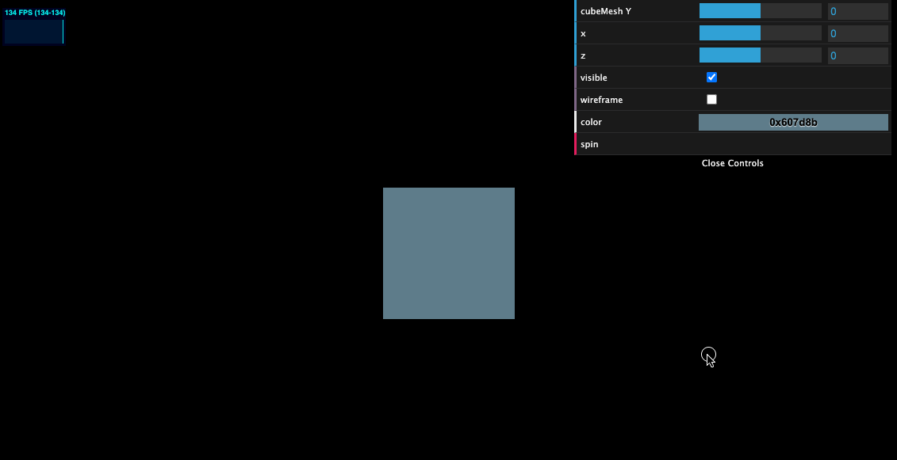
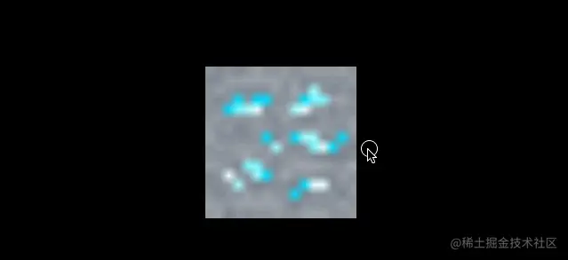
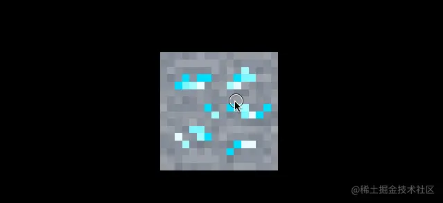

# 资源记录

## 资源网站

### Textures 资源


[https://www.poliigon.com/](https://www.poliigon.com/)



[https://3dtextures.me/](https://3dtextures.me/)



[https://www.arroway-textures.ch/](https://www.arroway-textures.ch/)



## vscode 插件

### WebGL GLSL Editor



### Shader languages support for VS Code




## API

> 高度备份以下系列的文章
>
> 作者：CS\_Joe\
> 链接：https://juejin.cn/post/7101207231382683655\
> 来源：稀土掘金\
> 著作权归作者所有。商业转载请联系作者获得授权，非商业转载请注明出处。

### Clock




Clock官方文档


* `.getElapsedTime () : Float` 获取自时钟启动后的秒数，同时将 .oldTime 设置为当前时间。 如果 .autoStart 设置为 true 且时钟并未运行，则该方法同时启动时钟。
* `.getDelta () : Float` 获取自 .oldTime 设置后到当前的秒数。 同时将 .oldTime 设置为当前时间。 如果 .autoStart 设置为 true 且时钟并未运行，则该方法同时启动时钟。

### Camera




Camera官方文档


[Camera](https://link.juejin.cn/?target=https%3A%2F%2Fthreejs.org%2Fdocs%2Findex.html%23api%2Fen%2Fcameras%2FCamera) 是一个抽象类，一般不直接使用，其他类型的 Camera 实现了这个抽象类。有

* ArrayCamera 包含着一组子摄像机，常用于**多人同屏的渲染**，更好地提升VR场景的渲染性能
* StereoCamera 双透视摄像机（立体相机），常用于创建 **3D 立体影像**，比如 3D 电影之类或 VR
* CubeCamera 有6个渲染，分别是立方体的6个面，常用于**渲染环境、反光**等
* OrthographicCamera 正交相机，在这种投影模式下，无论物体距离相机距离远或者近，在最终渲染的图片中物体的大小都保持不变。这对于**渲染2D场景或者UI元素**是非常有用的。
* [PerspectiveCamera](https://threejs.org/docs/index.html#api/en/cameras/PerspectiveCamera) 透视相机，这一投影模式被用来**模拟人眼所看到的景象**，它是3D场景的渲染中使用得最普遍的投影模式。&#x20;

#### PerspectiveCamera 透视相机

```javascript
PerspectiveCamera(fov : Number, aspect : Number, near : Number, far : Number)
```

* `fov` — 摄像机视锥体垂直视野角度
* `aspect` — 摄像机视锥体长宽比
* `near` — 摄像机视锥体近端面
* `far` — 摄像机视锥体远端面

这些参数一起定义了摄像机的 viewing frustum（视锥体）。

<figure><figcaption></figcaption></figure>

透视图中，灰色的部分是视锥体，是可能被渲染的物体所在的区域。fov 是视锥体竖直方向上的张角（是角度制而非弧度制），如侧视图所示。

aspect 等于 width / height，是照相机水平方向和竖直方向长度的比值，通常设为 Canvas 的横纵比例。

near 和 far 分别是照相机到视锥体最近、最远的距离，均为正值，且 far 应大于 near。


但请注意，不要将 near 和 far 设置为比较极端的数值，如 0.0001 和 99999，这可能引起 bug，让 threejs 无法分辨物体的前后，导致闪动


#### OrthographicCamera 正交相机

```javascript
OrthographicCamera( left : Number, right : Number, top : Number, bottom : Number, near : Number, far : Number )
```

* `left` — 摄像机视锥体左侧面。
* `right` — 摄像机视锥体右侧面。
* `top` — 摄像机视锥体上侧面。
* `bottom` — 摄像机视锥体下侧面。
* `near` — 摄像机视锥体近端面。
* `far` — 摄像机视锥体远端面。

这些参数一起定义了摄像机的 viewing frustum（视锥体），下图灰色部分为 frustum，只有在视景体内部（下图中的灰色部分）的物体才可能显示在屏幕上，而视景体外的物体会在显示之前被裁减掉。

<figure><figcaption></figcaption></figure>

为了保持照相机的横竖比例，需要保证 `(right - left)` 与 `(top - bottom)` 的比例与 Canvas 宽度与高度的比例一致。


### Control

Three.js 内置的控制器如下：



* `FlyControls` 启用了一种类似于数字内容创建工具（例如Blender）中飞行模式的导航方式。 你可以**在3D空间中任意变换摄像机**，并且无任何限制（例如，专注于一个特定的目标），使相机像飞行一样移动。
  * `FirstPersonControls` 该类是 FlyControls 的另一个实现。
* `PointerLockControls` 该类的实现是基于Pointer Lock API的。 对于**第一人称3D游戏**来说， PointerLockControls 是一个非常完美的选择。
* `OrbitControls` （轨道控制器）可以使得相机**围绕目标进行轨道运动**。
* `TrackballControls` 与 OrbitControls 相类似。然而，它不能恒定保持摄像机的up向量。 这意味着，如果摄像机绕过“北极”和“南极”，则不会翻转以保持“右侧朝上”，提供更自由的相机旋转。
* `TransformControls` 该类可提供一种类似于在数字内容创建工具（例如Blender）中对模型进行交互的方式，来在3D空间中变换物体。 和其他控制器不同的是，变换控制器不倾向于对场景摄像机的变换进行改变。
* `DragControls` 该类被用于提供一个拖放交互。

### Geometry - Threejs 内置几何体与自己创建几何体




[BoxGeometry](https://threejs.org/docs/index.html#api/zh/geometries/BoxGeometry)


以下内置几何体列表咨询了下GPT-4，可能有误，仅供参考：

* [BoxGeometry](https://threejs.org/docs/index.html#api/zh/geometries/BoxGeometry)：用于生成立方体或长方体几何体。
* [CapsuleGeometry](https://threejs.org/docs/index.html#api/zh/geometries/CapsuleGeometry)：用于创建胶囊形状的几何体。
* [CircleGeometry](https://threejs.org/docs/index.html#api/zh/geometries/CircleGeometry)：用于生成圆形几何体。
* [ConeGeometry](https://threejs.org/docs/index.html#api/zh/geometries/ConeGeometry)：用于创建圆锥形状的几何体。
* [CylinderGeometry](https://threejs.org/docs/index.html#api/zh/geometries/CylinderGeometry)：用于生成圆柱形几何体。
* [DodecahedronGeometry](https://threejs.org/docs/index.html#api/zh/geometries/DodecahedronGeometry)：用于创建十二面体几何体。
* [EdgesGeometry](https://threejs.org/docs/index.html#api/zh/geometries/EdgesGeometry)：用于从另一个几何体中提取边缘。
* [ExtrudeGeometry](https://threejs.org/docs/index.html#api/zh/geometries/ExtrudeGeometry)：用于通过拉伸路径来创建几何体。
* [IcosahedronGeometry](https://threejs.org/docs/index.html#api/zh/geometries/IcosahedronGeometry)：用于生成二十面体几何体。
* [LatheGeometry](https://threejs.org/docs/index.html#api/zh/geometries/LatheGeometry)：用于通过旋转轮廓线生成几何体。
* [OctahedronGeometry](https://threejs.org/docs/index.html#api/zh/geometries/OctahedronGeometry)：用于创建八面体几何体。
* [PlaneGeometry](https://threejs.org/docs/index.html#api/zh/geometries/PlaneGeometry)：用于生成平面几何体。
* [PolyhedronGeometry](https://threejs.org/docs/index.html#api/zh/geometries/PolyhedronGeometry)：用于创建多面体几何体。
* [RingGeometry](https://threejs.org/docs/index.html#api/zh/geometries/RingGeometry)：用于生成环形几何体。
* [ShapeGeometry](https://threejs.org/docs/index.html#api/zh/geometries/ShapeGeometry)：用于根据形状生成几何体。
* [SphereGeometry](https://threejs.org/docs/index.html#api/zh/geometries/SphereGeometry)：用于生成球体几何体。
* [TetrahedronGeometry](https://threejs.org/docs/index.html#api/zh/geometries/TetrahedronGeometry)：用于创建四面体几何体。
* [TorusGeometry](https://threejs.org/docs/index.html#api/zh/geometries/TorusGeometry)：用于生成圆环体几何体。
* [TorusKnotGeometry](https://threejs.org/docs/index.html#api/zh/geometries/TorusKnotGeometry)：用于创建圆环结几何体。
* [TubeGeometry](https://threejs.org/docs/index.html#api/zh/geometries/TubeGeometry)：用于根据路径生成管状几何体。
* [WireframeGeometry](https://threejs.org/docs/index.html#api/zh/geometries/WireframeGeometry)：用于从另一个几何体创建线框样式几何体。

使用 Three.js 的 [`BufferGeometry`](https://threejs.org/docs/index.html#api/zh/core/BufferGeometry) 和 [`BufferAttribute`](https://threejs.org/docs/index.html#api/zh/core/BufferAttribute)，你可以创建自定义的几何体。这种方法允许你直接定义顶点的位置、颜色、法线等属性，从而构建复杂和高效的三维模型。下面是一个简单的示例，展示了如何使用 `BufferGeometry` 和 `BufferAttribute` 来定义一个简单的三角形几何体。

#### 示例代码

```javascript
import * as THREE from 'three';

// 创建一个场景
const scene = new THREE.Scene();

// 创建一个相机
const camera = new THREE.PerspectiveCamera(75, window.innerWidth / window.innerHeight, 0.1, 1000);
camera.position.z = 5;

// 创建一个渲染器
const renderer = new THREE.WebGLRenderer();
renderer.setSize(window.innerWidth, window.innerHeight);
document.body.appendChild(renderer.domElement);

// 创建一个空的 BufferGeometry
const geometry = new THREE.BufferGeometry();

// 定义三角形的三个顶点的位置
const vertices = new Float32Array([
    0.0, 1.0, 0.0, // 第一个顶点的 x, y, z 坐标
    -1.0, -1.0, 0.0, // 第二个顶点的 x, y, z 坐标
    1.0, -1.0, 0.0  // 第三个顶点的 x, y, z 坐标
]);

// 创建一个 BufferAttribute 来存储这些顶点
const vertexBufferAttribute = new THREE.BufferAttribute(vertices, 3);
geometry.setAttribute('position', vertexBufferAttribute);

// 创建一个材质
const material = new THREE.MeshBasicMaterial({ color: 0xff0000 });

// 使用几何体和材质创建一个网格
const mesh = new THREE.Mesh(geometry, material);

// 将网格添加到场景中
scene.add(mesh);

// 渲染循环
function animate() {
    requestAnimationFrame(animate);
    renderer.render(scene, camera);
}

animate();
```

在使用 `BufferGeometry` 时，你需要手动定义所有的顶点和它们的属性，这比使用 Three.js 的内置几何体更为复杂，但提供了更高的灵活性。

该示例创建了一个简单的三角形，但你可以通过添加更多的顶点和属性来创建更复杂的几何体。


### dat.GUI（debugUI）



`dat.GUI` 是一个轻量级的图形用户界面，用于改变 JavaScript 变量的值并且实时看到结果，非常适合用于调试和实验。它广泛用于 WebGL 和 Canvas 项目中，特别是与 Three.js 结合时，用于动态调整场景参数。参见：[dat.GUI API 文档](https://github.com/dataarts/dat.gui/blob/master/API.md)

#### 主要特性

1. **易于集成**：`dat.GUI` 非常简单，可以轻松集成到任何项目中。
2. **实时调整**：允许实时调整和查看变量的变化，非常适合实验和调试。
3. **多种控件类型**：支持多种类型的控件，如滑块、颜色选择器、文本输入等。
4. **自定义界面**：可以自定义界面布局和样式，以适应不同的需求。
5. **轻量级**：非常轻巧，不会对项目性能造成明显影响。

#### 基本使用

1. **创建 GUI**：首先创建一个 `dat.GUI` 实例。
2. **添加控件**：通过 `add` 方法添加控件，可以指定要控制的对象和属性。
3. **设置范围和步长**：对于数值类型的控件，可以设置范围和步长。
4. **监听变化**：可以添加监听器来响应值的变化。

#### 示例代码

```javascript
// 引入 dat.GUI
import dat from 'dat.gui';

// 创建一个对象，其属性将被 dat.GUI 修改
const settings = {
    color: '#ffae23',
    size: 10
};

// 创建 dat.GUI 实例
const gui = new dat.GUI();

// 添加颜色控制器
gui.addColor(settings, 'color');

// 添加大小控制器
gui.add(settings, 'size', 0, 100);
```

#### 注意事项

* `dat.GUI` 主要用于开发阶段，用于调试和参数调整，通常不在生产环境中使用。
* 它非常适合与 3D 图形库（如 Three.js）结合使用，用于实时调整场景、材质、光源等参数。
* `dat.GUI` 的界面简洁直观，但功能相对基础，不适合作为复杂应用程序的主要用户界面。

<figure><figcaption><p>动图演示</p></figcaption></figure>

### Texture 纹理




&#x20;[Texture](https://threejs.org/docs/index.html#api/zh/textures/Texture)


纹理是覆盖在几何体表面的图片，当把纹理按照特定的方式映射到物体表面上的时候能使物体看上去更加真实。

可以前往 [3dtextures.me](https://link.juejin.cn/?target=https%3A%2F%2F3dtextures.me%2F) 寻找合适的纹理贴图，这个网站是提供了具有漫反射、法线、置换、遮挡、镜面反射和粗糙度贴图的**免费无缝 PBR 纹理**。

PBR 原则是基于物理的渲染(Physically Based Rendering)，基于与现实世界的物理原理更相符的基本理论所构成的渲染技术。PBR 已经成为一种标准，很多设计软件和库都在使用，如 Three.js, Blender 等

在 Three.js 中，纹理（Texture）是一种非常重要的概念，它用于在三维物体表面添加细节，如颜色、图案、光泽等。纹理通常是从图像文件加载的，但也可以是动态生成的图像或视频。

#### 纹理的基本概念

1. **图像源**：纹理通常来源于图像文件，如 PNG、JPG 等格式。也可以使用视频或者实时渲染的画布（Canvas）作为纹理。
2. **映射**：纹理映射（Texture Mapping）是将纹理应用到几何体上的过程。这涉及到纹理坐标（UV坐标），它定义了图像上的哪一部分映射到几何体的哪一部分。
3. **重复和包裹**：纹理可以在物体表面重复（平铺），也可以进行不同的包裹模式，如镜像重复。
4. **过滤**：纹理过滤决定了纹理在放大或缩小时的显示效果。常见的过滤方式包括线性过滤和最近邻过滤。
5. **Mipmapping**：Mipmaps 是纹理的多级渐进式版本，用于提高渲染效率和减少走样。

#### 在 Three.js 中使用纹理

在 Three.js 中，使用纹理的基本步骤如下：

1. **加载纹理**：使用 `THREE.TextureLoader` 加载图像作为纹理。
2. **创建材质**：将纹理应用到材质中。Three.js 提供了多种材质，如 `THREE.MeshBasicMaterial`、`THREE.MeshStandardMaterial` 等。
3. **应用材质**：将材质应用到几何体上，创建网格（Mesh）。

#### 示例代码

```javascript
import * as THREE from 'three';

// 创建场景、相机和渲染器
const scene = new THREE.Scene();
const camera = new THREE.PerspectiveCamera(75, window.innerWidth / window.innerHeight, 0.1, 1000);
const renderer = new THREE.WebGLRenderer();
renderer.setSize(window.innerWidth, window.innerHeight);
document.body.appendChild(renderer.domElement);

// 加载纹理
const textureLoader = new THREE.TextureLoader();
const texture = textureLoader.load('path/to/your/image.jpg');

// 创建材质并应用纹理
const material = new THREE.MeshBasicMaterial({ map: texture });

// 创建几何体并应用材质
const geometry = new THREE.BoxGeometry();
const cube = new THREE.Mesh(geometry, material);
scene.add(cube);

camera.position.z = 5;

// 渲染循环
function animate() {
    requestAnimationFrame(animate);
    renderer.render(scene, camera);
}

animate();
```

#### 注意事项

* 纹理的分辨率最好是 2 的幂次方，这样可以在大多数图形处理器上获得最佳性能。
* 加载纹理可能需要一些时间，因此在纹理完全加载之前，可能需要考虑如何处理未加载的状态。
* 纹理映射和材质的选择对最终效果有很大影响，需要根据具体需求进行调整。

### LoadingManager 管理加载过程


[LoadingManager](https://threejs.org/docs/index.html#api/zh/loaders/managers/LoadingManager)


Three.js 的 `LoadingManager` 是一个用于管理和协调多个加载过程的工具。在 Three.js 中，加载资源（如纹理、模型等）是一个异步过程，`LoadingManager` 提供了一种方式来追踪这些异步加载过程的状态，并在所有资源加载完成时执行特定的操作。

#### 主要功能

1. **进度追踪**：`LoadingManager` 可以追踪多个加载器（如 `TextureLoader`, `FileLoader` 等）的加载进度。
2. **事件处理**：它提供了多个事件处理器，如 `onLoad`（所有资源加载完成时触发）、`onProgress`（资源加载过程中触发）、`onError`（加载出错时触发）等。
3. **自定义加载器**：可以为不同的加载器指定不同的 `LoadingManager`，以实现更细粒度的控制。

#### 基本用法

```javascript
import * as THREE from 'three';

// 创建一个 LoadingManager
const manager = new THREE.LoadingManager();

// 设置 onLoad 事件处理器
manager.onLoad = function () {
    console.log('所有资源加载完成！');
};

// 设置 onProgress 事件处理器
manager.onProgress = function (url, loaded, total) {
    console.log('正在加载: ' + url + ' (' + loaded + '/' + total + ')');
};

// 设置 onError 事件处理器
manager.onError = function (url) {
    console.log('加载出错: ' + url);
};

// 使用这个 LoadingManager 创建加载器
const textureLoader = new THREE.TextureLoader(manager);
const objLoader = new THREE.OBJLoader(manager);

// 使用加载器加载资源
textureLoader.load('path/to/your/texture.jpg', function (texture) {
    // 使用纹理
});

objLoader.load('path/to/your/model.obj', function (object) {
    // 使用模型
});
```

#### 使用场景

`LoadingManager` 非常适合用于以下场景：

* **预加载**：在渲染场景之前预加载所有必要的资源。
* **加载进度显示**：显示加载进度或加载动画。
* **错误处理**：处理加载过程中的错误。

#### 注意事项

* 在使用 `LoadingManager` 时，确保所有相关的加载器都使用了同一个 `LoadingManager` 实例。
* `LoadingManager` 对于管理大型项目中的资源加载非常有用，可以提高用户体验和调试效率。

### UV unwrapping

在 Three.js 和其他 3D 图形应用中，UV Unwrapping 是一个重要的概念，它涉及到将 3D 模型的表面映射到二维纹理上的过程。这个过程是纹理贴图（Texture Mapping）的关键部分，确保纹理图像正确地应用于三维物体的表面。

#### UV坐标

* **UV坐标**：在 3D 建模和渲染中，UV坐标是二维纹理坐标，通常用 "U" 和 "V" 表示。这些坐标定义了纹理如何映射到模型的表面。因为"X"、"Y" 和 "Z" 已经用于表示模型空间中 3D 对象的轴，而 "W" 用于计算四元数旋转，这是计算机图形学中的常见操作。
* **U坐标**：通常对应于纹理的水平轴。
* **V坐标**：通常对应于纹理的垂直轴。

#### UV Unwrapping 过程

1. **模型分割**：首先，模型的表面被分割成若干个小片（通常是多边形，如三角形或四边形），这些小片被称为UV面片。
2. **展平**：然后，这些UV面片在二维空间中展开或展平，以便它们可以映射到二维纹理上。
3. **排列**：展平后的UV面片被排列在一个称为UV贴图的二维空间中。这个过程需要小心处理，以避免重叠和扭曲，确保纹理在模型表面上正确显示。

#### 在 Three.js 中的应用

在 Three.js 中，UV Unwrapping 通常是在3D建模软件中完成的，然后导出模型和相应的UV贴图。Three.js 使用这些信息来正确渲染纹理。

* **导入模型**：导入的模型应包含UV坐标数据。
* **应用纹理**：将纹理应用到模型时，Three.js 会根据UV坐标将纹理映射到模型的表面。

#### 注意事项

* **UV重叠**：UV面片的重叠可能导致纹理渲染错误。
* **扭曲和伸展**：不当的UV Unwrapping 可能导致纹理在模型上扭曲或伸展。
* **优化**：为了优化性能和纹理质量，UV贴图应该尽可能紧凑且合理分布。

UV Unwrapping 是3D建模和渲染的一个复杂但重要的部分，它直接影响到最终渲染的质量和真实感。在 Three.js 中，虽然不直接进行UV Unwrapping，但理解其原理对于处理纹理映射和解决相关问题是非常有帮助的。

打印几何体的uv坐标，可以看到

```js
const box = new THREE.BoxGeometry(1, 1, 1)
const material = new THREE.MeshBasicMaterial({
  map: colorTexture,
})
console.log(box.attributes.uv)
```

<figure><figcaption></figcaption></figure>

其中 array 为 Float32Array，uv 坐标两两一组，另一个属性 itemSize 为 2 也是说明这一点。这些uv坐标描述了纹理是如何放置在几何体表面的。

关于 UV 纹理贴图，就先了解到这里，后续需要时会深入学习。



### Transforming the Texture 纹理变换

在 Three.js 中，纹理变换（Transforming the Texture）是指对纹理进行平移、旋转、缩放等操作，以改变其在三维物体表面的显示方式。这些变换允许开发者在不改变原始纹理图像的情况下，调整纹理的外观和布局。

#### 纹理变换的类型

1. **平移（Offset）**：通过改变纹理的偏移量，可以移动纹理在物体表面的位置。这在创建重复模式或调整纹理对齐时非常有用。
2. **旋转（Rotation）**：纹理可以在其平面内旋转。这可以帮助调整纹理的方向，使其与物体的特定部分对齐。
3. **重复（Repeat）**：改变纹理的重复次数可以使纹理在物体表面重复出现，这对于创建平铺效果或纹理细节非常重要。

#### 在 Three.js 中实现纹理变换

在 Three.js 中，纹理对象（`THREE.Texture`）提供了属性来控制这些变换：

* `offset`：一个 `THREE.Vector2`，表示纹理的偏移量。
* `rotation`：一个浮点数，表示纹理的旋转角度（以弧度为单位）。
* `repeat`：一个 `THREE.Vector2`，表示纹理在每个方向上的重复次数。

#### 示例代码

```javascript
import * as THREE from 'three';

// 加载纹理
const textureLoader = new THREE.TextureLoader();
const texture = textureLoader.load('path/to/texture.jpg');

// 设置纹理变换
texture.offset.set(0.5, 0.5); // 将纹理向右和向下移动一半的距离
texture.rotation = Math.PI / 4; // 将纹理旋转45度
texture.repeat.set(2, 2); // 在每个方向上重复纹理两次

// 创建材质并应用纹理
const material = new THREE.MeshBasicMaterial({ map: texture });

// 创建几何体并应用材质
const geometry = new THREE.BoxGeometry();
const cube = new THREE.Mesh(geometry, material);
scene.add(cube);
```

#### 注意事项

* 当使用纹理重复时，通常最好使用分辨率为2的幂的纹理图像，以确保兼容性和性能。
* 纹理旋转是围绕纹理的中心点进行的，因此在旋转前可能需要调整偏移量以获得期望的效果。
* 在进行纹理变换时，需要注意可能对渲染性能产生的影响，尤其是在大型场景或多个物体上使用时。

纹理变换是一个强大的工具，可以在不增加额外纹理资源的情况下，极大地增强场景的视觉效果和多样性。



在 Three.js 中，`.wrapS` 和 `.wrapT` 是 `THREE.Texture` 对象的属性，用于定义纹理在水平（S）和垂直（T）方向上的包裹（Wrapping）模式。这些设置决定了纹理在超出 \[0, 1] 范围的 UV 坐标时的表现。

#### `.wrapS`：水平方向的包裹模式

* **属性类型**：`number`
* **描述**：定义纹理在水平方向（U方向）上的包裹模式。
* **默认值**：`THREE.ClampToEdgeWrapping`

**可选值**

1. **`THREE.ClampToEdgeWrapping`**：
   * 纹理的边缘像素被延伸到网格的边缘。
   * 在UV坐标超出 \[0, 1] 范围时，纹理不会重复，而是将边缘的像素延伸出去。
2. **`THREE.RepeatWrapping`**：
   * 纹理在水平方向上重复。
   * 当UV坐标超出 \[0, 1] 范围时，纹理图案会不断重复。
3. **`THREE.MirroredRepeatWrapping`**：
   * 纹理在水平方向上重复，并在每次重复时进行镜像。
   * 类似于 `RepeatWrapping`，但每次重复都会翻转图像。

#### `.wrapT`：垂直方向的包裹模式

* **属性类型**：`number`
* **描述**：定义纹理在垂直方向（V方向）上的包裹模式。
* **默认值**：`THREE.ClampToEdgeWrapping`

**可选值**

与 `.wrapS` 相同，`.wrapT` 也支持 `ClampToEdgeWrapping`、`RepeatWrapping` 和 `MirroredRepeatWrapping` 这三种模式。

#### 使用示例

```javascript
import * as THREE from 'three';

// 加载纹理
const textureLoader = new THREE.TextureLoader();
const texture = textureLoader.load('path/to/texture.jpg');

// 设置水平和垂直包裹模式
texture.wrapS = THREE.RepeatWrapping;
texture.wrapT = THREE.MirroredRepeatWrapping;

// 设置重复次数（如果使用 RepeatWrapping 或 MirroredRepeatWrapping）
texture.repeat.set(2, 2); // 在每个方向上重复纹理两次

// 创建材质并应用纹理
const material = new THREE.MeshBasicMaterial({ map: texture });

// 创建几何体并应用材质
const geometry = new THREE.BoxGeometry();
const cube = new THREE.Mesh(geometry, material);
scene.add(cube);
```

* 包裹模式的选择会直接影响纹理在物体表面的外观，特别是在纹理边缘处。

### Filtering and Mipmapping - 纹理过滤和 Mipmap 优化

在 Three.js 和其他 3D 渲染环境中，纹理过滤（Filtering）和 Mipmapping 是两个关键概念，用于优化纹理的显示效果和性能。

#### 纹理过滤（Filtering）

纹理过滤是指在将纹理映射到比其原始分辨率大或小的表面时，如何处理纹理像素的过程。主要有两种类型的过滤：

1. **放大过滤（Magnification Filter）**：当纹理被映射到比其原始分辨率更大的区域时使用。常见的放大过滤方法有：
   * `THREE.LinearFilter`：使用线性插值，为相邻的四个像素提供平滑过渡，通常用于更平滑的纹理外观。
   * `THREE.NearestFilter`：选择最近的单个像素，可能会产生像素化的效果，但不会引入模糊。
2. **缩小过滤（Minification Filter）**：当纹理被映射到比其原始分辨率更小的区域时使用。除了 `LinearFilter` 和 `NearestFilter`，还可以使用 Mipmapping 相关的过滤方法。

#### Mipmapping

Mipmapping 是一种优化技术，用于处理纹理在远离摄像机或小尺寸显示时的效率和质量。它通过创建纹理的**多个预缩小版本**（称为 Mipmap 层级）来实现。在渲染时，根据纹理在屏幕上的大小选择合适的 Mipmap 层级，这可以**减少摩尔纹**（Moire patterns）和提高渲染效率。

常见的与 Mipmapping 相关的缩小过滤方法包括：

* `THREE.LinearMipmapLinearFilter`：在两个最接近大小的 Mipmap 层级之间使用线性插值，然后对这些颜色值再次进行线性插值。
* `THREE.LinearMipmapNearestFilter`：选择最接近大小的 Mipmap 层级，并使用线性插值。
* `THREE.NearestMipmapLinearFilter`：在两个最接近大小的 Mipmap 层级之间使用线性插值，但不对颜色值进行插值。
* `THREE.NearestMipmapNearestFilter`：选择最接近大小的 Mipmap 层级，不进行任何插值。



这里的文章里的图片很形象，如下 [小贴图为](https://p3-juejin.byteimg.com/tos-cn-i-k3u1fbpfcp/86c7494d5c89489d964f9f66813c3530\~tplv-k3u1fbpfcp-zoom-1.image) .png>)

| magFilter 为 LinearFilter (默认)                                                                                                                      | magFilter 为 NearestFilter                                                                                                                          |
| -------------------------------------------------------------------------------------------------------------------------------------------------- | -------------------------------------------------------------------------------------------------------------------------------------------------- |
|  |  |

另外在放大滤镜下 NearestFilter 的性能也会更好。

使用 `colorTexture.generateMipmaps = false` 这个属性会禁止生成 Mipmaps，缩小过滤和放大过滤都会默认为 NearestFilter。

#### 使用示例

```javascript
javascriptCopy codeimport * as THREE from 'three';

// 加载纹理
const textureLoader = new THREE.TextureLoader();
const texture = textureLoader.load('path/to/texture.jpg');

// 设置放大和缩小过滤
texture.magFilter = THREE.LinearFilter;
texture.minFilter = THREE.LinearMipmapLinearFilter;

// 生成 Mipmaps（对于自定义纹理或非2的幂纹理，可能需要手动设置）
texture.generateMipmaps = true;

// 创建材质并应用纹理
const material = new THREE.MeshBasicMaterial({ map: texture });

// 创建几何体并应用材质
const geometry = new THREE.BoxGeometry();
const cube = new THREE.Mesh(geometry, material);
scene.add(cube);
```

#### 注意事项

* Mipmapping 通常用于缩小过滤，而不是放大过滤。
* 使用 Mipmapping 可以提高性能，特别是在处理大场景和多个纹理时。
* 纹理的分辨率最好是2的幂（如256x256，512x512等），以确保最佳的 Mipmapping 效果和兼容性。

> mipmapping 的操作是不断的将图片缩小一倍，直到 1_1 像素，可理解为不停地除以2，所以建议使用 2 的 n 次幂的宽高尺寸图片，如 512_512、1024_1024、512_2048 等，如果不是这样的尺寸，ThreeJs 也会帮你优化，但可能会带来额外的性能损耗或渲染问题。


## Tips

### 画布与分辨率设置



* **画布充满窗口**：使用`window.innerWidth`和`window.innerHeight`属性来设置画布尺寸，使之充满整个浏览器窗口，并建议移除canvas标签上的宽高设置​​。
* **处理窗口调整**：文章中解释了如何监听resize事件，以便在窗口尺寸变化时更新画布尺寸、相机的视角比例和渲染器的大小​​。&#x20;
* **像素比问题**：讨论了如何处理屏幕上的锯齿问题，通过设置`renderer.setPixelRatio()`来调整像素比，推荐最大值设为2以兼顾性能​​。

```javascript
renderer.setPixelRatio(Math.min(window.devicePixelRatio, 2))
// resize
window.addEventListener('resize', () => {
  // update sizes
  sizes.width = window.innerWidth
  sizes.height = window.innerHeight

  // update camera
  camera.aspect = sizes.width / sizes.height
  camera.updateProjectionMatrix()

  // update renderer
  renderer.setSize(sizes.width, sizes.height)
+  renderer.setPixelRatio(Math.min(window.devicePixelRatio, 2))
})
```

* **全屏功能**：介绍了如何监听双击事件来实现全屏切换功能，并考虑到了 Safari 浏览器兼容

```javascript
window.addEventListener('dblclick', () => {
  const fullscreenElement = document.fullscreenElement || document.webkitFullscreenElement
  if (fullscreenElement) {
    if (document.exitFullscreen) {
      document.exitFullscreen()
    } else {
      document.webkitExitFullscreen()
    }
  } else {
    if (canvas.requestFullscreen) {
      canvas.requestFullscreen()
    } else {
      canvas.webkitRequestFullscreen()
    }
  }
})

```

